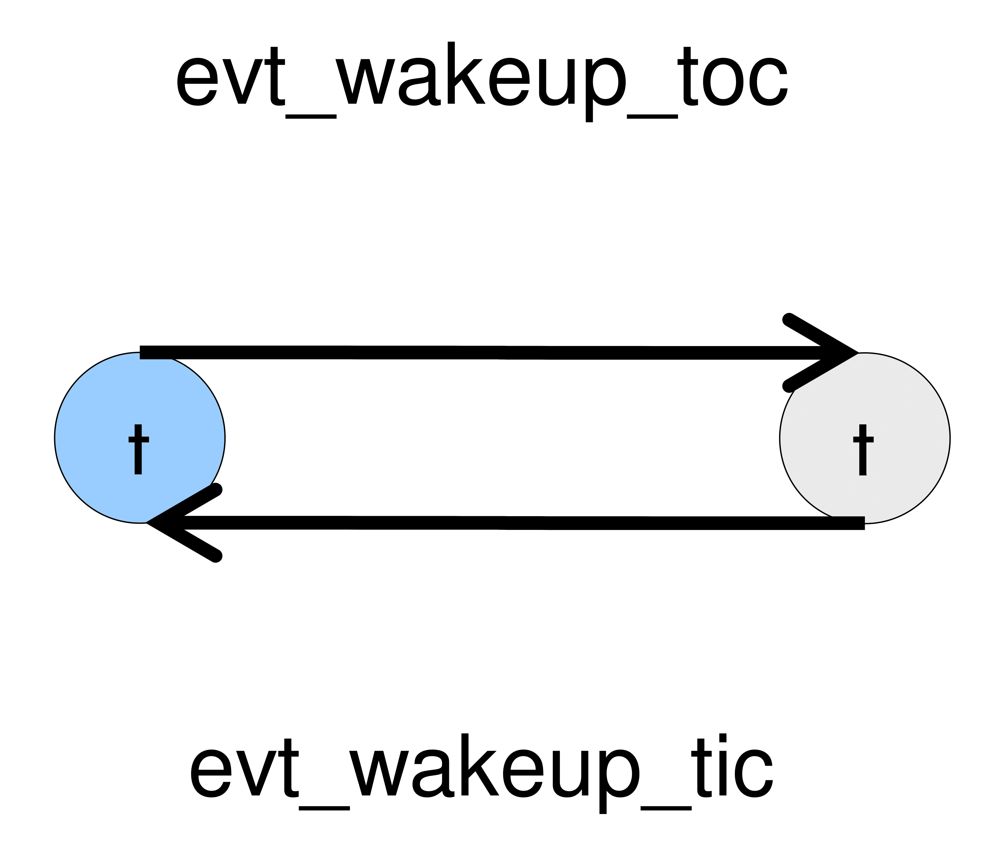

# MOES Lab 01
Laboratory 1 of the Modeling and Optimization of Embedded Systems course of the master degree in Embedded System (Electronic Engineering) of Politecnico di Torino, academic year 2020/2021. 
Tested with SystemC v2.3.3.

In case of problems try to source the .bashrc file with the command `. ~/.bashrc`.

## Exercise 1 - HelloWorld
A SystemC module is a C++ class, it encapsulates a hardware or software description.
SystemC defines that any module has to be derived from the existing class `sc_module`, and supplies a macro `SC_MODULE` to simplify the declaration process.

Inside the folder Exercise_1, there are two versions of HelloWorld realized by plain C++ and SystemC respectively, which simply print “Hello World !” on the console.
Read the comments on the source codes and compare the two versions. Finally compile the source code and run the obtained executable.
### Tip 1
To compile the code, open a terminal and change to the directory where the source file located.
- For C++ version, type `g++ HelloWorld.cpp main.cpp o run.x` in the terminal to compile the source code.
- For SystemC version, type `make` in the terminal to compile the source code.
### Tip 2
After compilation, an executable file named *run.x* is created. To run the simulation, just type `./run.x` in the terminal.
If you want to delete all created files (including the executable itself),
- for C++ version, type `rm run.x` in the terminal.
- for SystemC version, type `make clean` in the terminal.

## Exercise 2 - Modules
All programs need a starting point.
In C/C++, the starting point is called `main()`.
In SystemC, the starting point is called `sc_main()`, and this is where elaboration and simulation start.
By convention, SystemC programmers simply name the file containing `sc_main()`, as *main.cpp* to indicate to the C/C++ programmer that this is the place where everything begins.
The actual `main()` routine is located in the SystemC library itself and is not exposed to the user.

Inside the folder *Exercise_2*, an example `BasicModule` lists the fundamental and minimum elements to compose a SystemC module.
Read and compile the source code, and run the obtained executable.
Write a module from scratch using what you know, to display an output that could count down from 3 to 1.
Note that these simple examples do not use the `wait()` function call only because they involve just one `SC_THREAD`.
**When there is more than one, the `wait()` function must be called to allow other SC_THREADs or SC_METHODs to run.**
Simulation time may or may not advance (depending on whether you wait for an event that occurs in another delta cycle at the same simulation time, or wait for time).

### Tip 1
Within `sc_main()`, code executes in three distinct major stages: elaboration, simulation, and post processing.
- Elaboration, performed by executing the **constructors** of the various SC_MODULEs in the design, invokes code to register simulation processes and performs the connections between design module instances.
- `sc_start()` invokes the simulation stage where process code representing the behavior of the model executes.
This call lasts as long as the simulator is running, and returns to `sc_main` after simulation is complete.
Simulation completes when **the first** of three events occurs:
  1. Either there are no more events to be simulated in the queue, i.e. the design has reached quiescence.
  2. Or the `sc_stop()` method is called by one of the processes.
  3. Or the **simulation** time (optionally) specified as an argument to `sc_start()` has elapsed.
- Finally, post processing stage begins after returning from `sc_start()`.
During this stage (not used in the labs) waveform files are closed, errors detected by monitors are checked and reported, and so on.

### Tip 2
- To compile the code, open a terminal and change to the directory where the source file located. Then type `make` in the terminal.
- After compilation, an executable file named *run.x* is created. To run the simulation, just type `./run.x` in the terminal.
- If you want to delete all created files (including the executable itself), type `make clean` in the terminal.

## Exercise 3 - sc_time
The data type `sc_time` is used by the simulation kernel to track simulated time and to specify delays and timeouts.
SystemC uses a 64 bit unsigned integer to represent the `sc_time`.
Due to the limits of the implementation of time, we can only use it to represent discrete time.
Therefore, there is a minimum representable time quantum, called the **time resolution**, which can be get and set by the user.

`sc_time` class constructor: `sc_time(double, sc_time_unit )`, where `sc_time_unit` is an enumerated type defined different time units which are listed bellow:
- SC_FS femtosecond
- SC_PS picosecond
- SC_NS nanosecond
- SC_US microsecond
- SC_MS millisecond
- SC_SEC second

For example, `sc_time t(50, SC_NS)` creates an `sc_time` variable representing 50 nanoseconds.
And the simulation time resolution can be get and set through the following functions:
- `sc_time sc_get_time_resolution()`
- `void sc_set_time_resolution(double, sc_time_unit)`

The function `sc_time_stamp()` returns the current simulation time.
During elaboration and initialization stage, this function shall return a value of zero.
Constant `SC_ZERO_TIME` represents a time value of zero.
It is a good practice to use this constant whenever writing a time value of zero.

The reaction time and signal propagation time in the real world are modeled by the time delay in the simulated time.
The `wait()` method provides a syntax to allow this delay in `SC_THREAD()` process.
When a `wait()` is invoked, the `SC_THREAD` process blocks i tself and is resumed by the scheduler after the requested delay in simulated time.

***Note that simulation time is very different from wall clock time!***
I.e. a call of `wait(60, SC_ SEC)` does not return control after 60 seconds of real, physical time.
It returns control when **simulated time** is 60 seconds after the time when it was called.

A routine to exemplify the usage of `sc_time()` and `wait()` is given in *Exercise_3*.
Read and compile the source code, and run the obtained executable.
Modify the module you have designed in the *Exercise_2*, to simulate a counter that starts to countdown from 20 to 1 with a countdown interval of 20ns.

### Tip
- To compile the code, open a terminal and change to the directory where the source file located. Then type `make` in the terminal.
- After compilation, an executable file named *run.x* is created. To run the simulation, just type `./run.x` in the terminal.
- If you want to delete all created files (including the executable itself), type `make clean` in the terminal.

## Exercise 4 - sc_event
A SystemC event is the occurrence of an `sc_event` notification and happens at a single instant in time, which is used for synchronization.
A process instance may be triggered or resumed on the occurrence of an event, that is, when the event is notified.

To observe an event, the observer must be waiting for the event prior to its notification.
Any number of observers can wait for an event, and all of them will be notified **in the same delta cycle**.

A routine to illustrate the usage of `sc_event` and `wait(event_ name)` is given in *Exercise_4*.
Read and compile the source code, and run the obtained executable.

### Tip 1
- `event_name.notify(void)`           // zero delta cycle event notification; *do not use!*
- `event_name.notify(SC_ZERO_TIME)`   // next delta cycle event notification
- `event_name.notify(sc_time)`        // time (time>0) delayed event notification
- `event_name.notify(double, units)`  // time delayed event notification

### Tip 2
- `wait(event_name)`                  // waiting for event inside SC_THREAD

### Tip 3
- To compile the code, open a termi nal and change to the directory where the source file located. Then type `make` in the terminal.
- After compilation, an executable file named *run.x* is created. To run the simulation, just type `./run.x` in the
- If you want to delete all created files (including the executable itself), type `make clean` in the terminal.

## Exercise 5 - TicToc

Using the knowledge that you gained in the previous exercises, try to implement a SystemC simulation to simulate a "network" composed of two nodes (which are represented by simulation processes).
The nodes will perform something simple: one of the two nodes will wake up firstly from sleeping and keep awake for 10ns; afterwards, it invokes another node and goes to sleep again until being woken up by that waking node; and the two nodes will keep performing this procedure in turn.
That is to say, the two nodes alternatively keep awake for a while and wake up the sleeping node before going to sleep.
The node starts the communication is denoted as "tic" and the other is "toc", which are depicted in the figure bellow.

  

After the simulation, display on the terminal how many times each node has been awake (active) during the simulation.
### Tip:
- A `Makefile` has been provided in the folder *Exercise_5*, please store your code in that directory in order to compile and execute your simulation as the previous exercises.
