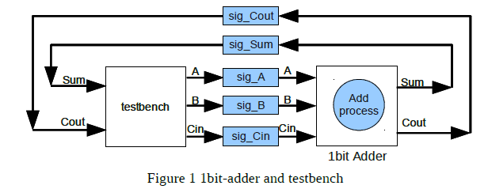

# MOES Lab 02
Laboratory 2 of the Modeling and Optimization of Embedded Systems course of the master degree in Embedded System (Electronic Engineering) of Politecnico di Torino, academic year 2020/2021.<br/>
Tested with SystemC v2.3.3.

In case of problems try to source the .bashrc file with the command `. ~/.bashrc`.

If this error occurs:
```
./run.x: error while loading shared libraries: libsystemc-2.3.3.so: cannot open shared object file: No such file or directory
```
Enter the command:
```
export LD_LIBRARY_PATH=/usr/local/systemc-2.3.3/lib-linux64:$LD_LIBRARY_PATH
```

If you want to remove the SystemC startup text enter the command:
```
export SYSTEMC_DISABLE_COPYRIGHT_MESSAGE=1
```

## Exercise 1 - SC_METHOD 
`SC_METHOD` is one kind of SystemC simulation processes, like `SC_THREAD`, and behaves like a function.
When called, it gets started and executed and returns execution back to the simulation kernel.
One major difference with `SC_THREAD` is the invocation.
`SC_METHOD` processes never suspend internally.
Instead, they run completely and return.

So far, we have already seen how to resume the process (in `SC_THREAD` using `wait()`).
SystemC also provides another way to specify the sensitivity for each process, which is called sensitivity list.
Sensitivity list is established for the desired process immediately after its registration as follows:
```
SC_THREAD(proc_thread); 
sensitive << event_name1 << event_name2 << ... ;
```
```
SC_METHOD(proc_method); 
sensitive << event_name1 << event_name2 << ... ;
```

Try to execute the program located in the folder *Exercise_1*.

### Tip
- To compile the code, open a terminal and change to the directory where the source file located. Then type `make` in the terminal. 
- After compilation, an executable file named *run.x* is created. To run the simulation, just type `./run.x` in the terminal. 
- If you want to delete all created files (including the executable itself), type `make clean` in the terminal. 

## Exercise 2 - SystemC Data Types 
Since the SystemC language is built on C++, all of the C++ data types are available.
Also SystemC lets you define new data types for new hardware technology (i.e., multi-valued logic) or for applications other than electronic system designs.
All of the SystemC data type are part of the `sc_dt` namespace, which may be used with the scope operator (`::`) to avoid naming collisions with other libraries.
Some of these data types are listed below, more details could be referred in the Language Reference Manual (LRM). 
-	`sc_bv<width>` bit vector (2 values, 0 and 1)
- `sc_logic` logic bit (4 values, 0, 1, X and Z)
-	`sc_lv<width>` logic vector
-	`sc_int<width>` int type with specified width, from 1 to 64 bits
-	`sc_uint<width>` unsigned int type with specified width, from 1 to 64 bits
-	`sc_bigint<width>` support for the larger number than native C++ data types
-	`sc_biguint<width>`
  
Try to compile the example code in *Exercise_2*. 

## Exercise 3 - Basics of sc_signal channel 
In SystemC, processes communicate using channels or events.
Modules may interconnect using channels, and connect via ports.
The powerful ability to have interchangeable channels is implemented through a component called interface.
Channels serve to encapsulate the mechanism through which processes communicate and hence to model the communication aspects or protocols of a system.
Channel can be used for inter-module communication or for inter-process communication within a module.
Interfaces provide a means of accessing channels.

Here, we only introduce `sc_signal`.
The syntax for declaring a SystemC sc_signal channel is: `sc_signal<T> sig_name;`

### Tip
-	`T sig_name.read()` // read value from channel 
-	`void sig_name.write(T  new_value)` // write value to channel 
-	`const sc_event& value_changed_event()` // event to indicate the value changing inside    the channel 

Observe how the `sc_signal<T>` is used in the example code inside folder *Exercise_3*, compile and run the simulation. 

## Exercise 4 - sc_ports
To connect the module with an `sc_signal` channel, ports `sc_in<T>` and `sc_out<T>` can be used for the module.
Other kinds of ports (e.g., `sc_port<Interface_Type>`) can be referred in the LRM.
Basically, a port can be viewed as a pointer to a channel.
Then modules can communicate to other modules via the port, which connected to a channel through an interface that enables reading and writing.
Read and execute the example code in *Exercise 4*.

## Exercise 5 - 1bit-Adder 
Using the knowledge you obtained from the previous exercises, try to implement a 1bit-adder and a testbench module in SystemC.
Connect the adder and the testbench to form a structure as depicted in the following figure.
Then, display the simulation result on the console. 

### Tip 1: 
-	`sig_A`, `sig_B`, `sig_C` can be realized by three `sc_signal` channels. 
-	`sig_Cout`, `sig_Sum` can be realized by two `sc_signal` channels. 
-	`A` and `B` are the inputs of the 1bit-adder, `Cin` is the carry in bit of the 1bit-adder. 
-	`Sum` is the output of the 1bit-adder, `Cout` is the carry out bit of the 1bit-adder. 
-	`Sum` = `A` ⊕ `B` ⊕ `Cin` 
-	`Cout` = (`A` · `B`) ⊕ (`Cin` · (`A` ⊕ `B`))

### Tip 2
-	A *Makefile* has been provided in the folder *Exercise_5*, please store your code in that directory in order to compile and execute your simulation as the previous exercises.

[//]: <p align="center">
[//]:   
[//]: </p>
