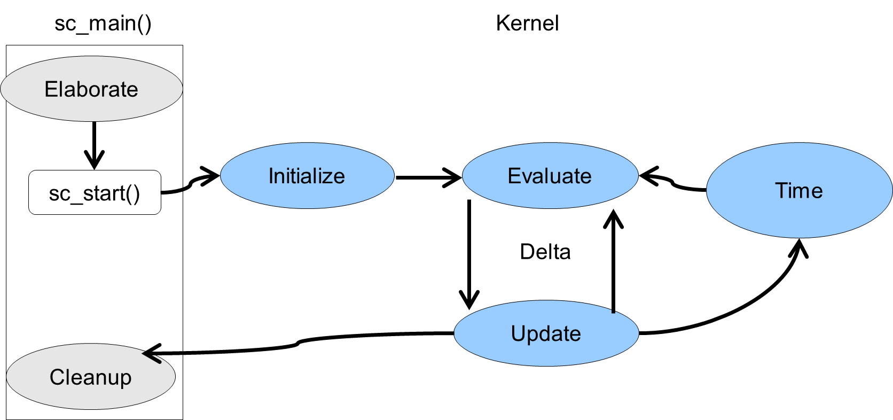

# MOES Lab 03
Laboratory 3 of the Modeling and Optimization of Embedded Systems course of the master degree in Embedded System (Electronic Engineering) of Politecnico di Torino, academic year 2020/2021. 
Tested with SystemC v2.3.3.

## Exercise 1 - Simulation cycle and advanced knowledge of sc_signal\<T\>
[//]:

[//]:  
[//]:

  
The execution of the simulation kernel can be depicted as shown in Figure 1.
1) *Elaborate*. During the elaboration stage, the modules and connections are established.
2) *Initialize*. After function `sc_start()` being called, the control is passed to the simulation kernel. In the initialize phase, each process is executed once. `SC_THREAD` process will be executed until the first synchronous point, `wait` statement, if there is one. Process can also be disabled for being executed in this stage by calling `dont_initialize()` after the process registration.
3) *Evaluate*. Select a ready process to run and execute/resume it. The simulation kernel remains in this stage until all ready processes have run.
4) *Update*. During this stage, the simulation kernel updates the values assigned to the channels in the previous evaluate cycle.  Steps 3 and 4 are referred as a **delta-cycle** (similar to VHDL and Verilog). If there is any event notification, e.g. because a signal has changed value, the simulation kernel goes back to step 3 without advancing the simulated time.
5) *Advance Time*. If no more processes need to be evaluated at that instant (as a result of the update), then the simulation kernel advances the simulated time to the next simulation time spot that has pending events, and repeats the execution from step 3.
6) *Cleanup*. If there are no simulation processes that need to be run (i.e. empty event queue), or the maximum time specified in `sc_start()`, or a process has called `sc_stop()`, the simulation ends.

`sc_signal<T>` channel is one of the special channels in SystemC. It uses the update phase as a point of data synchronization. To accomplish this synchronization, the channel has two storage locations: the **current value** and the **new value**. When a process writes to a `sc_signal` channel, the process stores into the new value rather than into the current value. When the update phase occurs, the simulation kernel copy the new value into the current value and also generate an `sc_event` to notify the value changed in the channel.

Read the code for the `sc_signal` channel example, and compile and run the simulation to verify the value stored in the signal channel. Consider in which cases, this property will be important to the modeling.

### Tip
- To compile the code, open a terminal and change to the directory where the source file located. Then type `make` in the terminal.
- After compilation, an executable file named *run.x* is created. To run the simulation, just type `./run.x` in the terminal.
- If you want to delete all created files (including the executable itself), type `make clean` in the terminal.

## Exercise 2 - Traffic light controller
A traffic light controller is located at the intersection between a main highway and a side road to control the flow of traffic. The main highway normally has a green light, for at least 10 seconds. The presence or arrival of a car on the side road will trigger the main highway light to go from green to yellow and to red, and the side road to go from red to green. The duration of the green light on the side road and the minimum duration of the green on the main road is 10 seconds, while the duration of the yellow light is 5 seconds.

In this exercise your task is to model this traffic light controller using SystemC signals. 

You should then add a testbench with a stimuli generator, which should simulate two scenarios:
1) A *bad* driver, who leaves without waiting for the green light.
2) A *good* driver, who waits for the green light and then leaves.

A couple of monitors in the testbench should print out when the car arrives and leaves, and when colors change.

## Exercise 3 - Traffic light controller and monitors
In this exercise, your task is to add three monitor threads to check the following properties:
1) If one road is green, then the other road is red.
2) The minimum duration of any green light is 10 seconds.
3) The maximum duration of any yellow light is 5 seconds.

To better demonstrate the correctness of your implementation, the test bench could also generate car arrivals at random times, and then the car leaving at random times as well.
