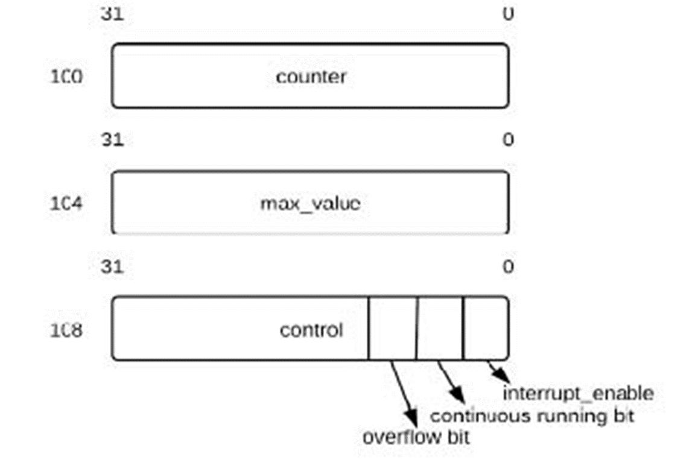

# MOES Lab 04
Laboratory 4 of the Modeling and Optimization of Embedded Systems course of the master degree in Embedded System (Electronic Engineering) of Politecnico di Torino, academic year 2020/2021. 
Tested with SystemC v2.3.3.

## Exercise 1
In Lab 3, you implemented the TLC using a simple `SC_MODULE`.
In the Folder lab4/Exercise_1 you will find the program for the TLC as described in Lab 3.
Compile, run and again verify its functionality.
This is just to provide everyone with the same starting point, regardless of how they implemented Lab 3.

It may be a good idea, if you managed to create the additional monitors at the end of Lab 3, to add them here as well.

## Exercise 2
In this exercise, you will decompose the monolithic functional model into a TLC and a TIMER as shown in this Figure.
They communicate using signals, so we are already implying a HW implementation here.

  

You should implement two versions of the timer, selected by using a macro called `ABSTRACT_TIMER` (as shown in *main.cpp*):
- If the macro is defined, then the timer can simply use the `wait(time, unit)` call.
- Otherwise, the timer should be modeled in a cycle-accurate manner, by adding a clock signal to it (with 1MHz frequency).
  In this way the model can count the elapsed time, in terms of clock ticks. 

The testbench should be the same as in Exercise 1.

## Exercise 3
In this exercise we will model the timer using the transaction-level interfaces seen in class (you can ignore the `reset()` method for simplicity).
The exercise directory contains only the interface definition file.

The refinement of the transactors should be for the execution directly on Linux, i.e. without needing a testbench (the user "implements" the car sensor).

## Exercise 4
In this exercise we will model the refinement of the transactors for hardware implementation, again as seen in class.

**The source file for the TLC must be the same as in the previous exercise, and the testbench must be the same as in Exercise 1.**

Note that in the main program, all the TLM ports of the TLC are connected to the same channel, which must of course implement all those interfaces.

## Exercise 5
In this exercise we will model the refinement of the transactors for software implementation on a microcontroller, again as seen in class. 

**The source file for the TLC and the testbench must again be the same as in the previous exercise.**

The timer will be implemented by a peripheral with these control registers:

  

Depending on the value written in these registers, the model will behave in different ways: 
- If `continuous` is true, the counter counts from `0` to `MAX_VALUE`, then it sets `overflow` to true, and restarts counting from `0`.
  `Overflow` is reset to `0` when control is read.
- If `continuous` is false, then when the `counter` register is written (typically a value of `0`), the timer counts until it reaches `MAX_VALUE`, then sets `overflow` to true, and stops (until `counter` is written, then it starts again).

The drivers for the car sensor and the light sensor should not use the PIO, as discussed in class, but the same signals as were used by the signal-level testbench of Exercise 1.

The entire system, apart from the same testbench as before, includes the following modules:

1. TLC_SW, which replaces the SystemC `wait()` call of the TLC modeled in Exercise 1.
   Unlike the HW-oriented TLC of Exercise 2, which uses signals to communicate with a HW timer, it has a port of type `timer_if`, and calls its interface method `void wait_for_sec(int n)`, which waits for N seconds.

2. A channel called `HW_DRIVERS` used by the TLC to interface with the car sensor and the lights.
   **This channel can be a slight variation of the HW driver module of the previous exercise, just removing the implementation of the timer interface.**
   It:
    - implements the `wait_for_car()`, `set_main()` and `set_sec()` interface methods, and 
    - has a car input signal and two light output signals.
    
3. Another channel called `TIMER_DRIVER` used by the TLC to control the timer.
   This "transactor" module implements the `void wait_for_sec(int n)` interface method required by the TLC module, and converts it to several `read` and `write` operations on the timer registers.
   It behaves as a "driver" or "wrapper" connecting different levels of abstraction, as well as the SW and the HW domains.
   
4. Another channel module called `BUS` that models the physical bus inside the micro-controller.
   It implements the bus interface, which contains two functions:
    - `void write(sc_int<32> addr, sc_int<32> data)`, which writes data to a given address and
    - `sc_int<32> read(sc_int<32> addr)`, which reads data from a given address.
    
   Different peripherals can be modeled in the bus.
   In this example the Timer registers have addresses 100 to 108, while the PIO registers (not used in this case, but only used as an example of another peripheral) have addresses 112-116. 

5. Another channel module called `TIMER_PERIPHERAL` that 
    - implements the bus interface, as seen in class, 
    - counts clock cycles (either by waiting for `1 SC_US` or by waiting for a clock edge, as you prefer).

Feel free to simplify the timer with respect to the functionality seen in class (e.g. do not implement continuous mode) if this task takes too long.

  

